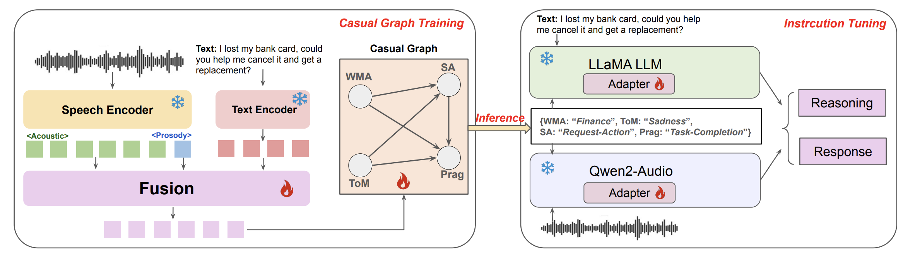

# Speech World Model




## Vicuna Deployment

This section describes how to deploy the [**Vicuna**](https://lmsys.org/blog/2023-03-30-vicuna/) model for local inference using the [FastChat](https://github.com/lm-sys/FastChat) framework.

### 1. Download and Install
You can obtain the Vicuna model weights following the official FastChat instructions:  
- **Model Weights:** [Vicuna Model Weights](https://github.com/lm-sys/FastChat?tab=readme-ov-file#model-weights)  
- **Installation Guide:** [FastChat Installation](https://github.com/lm-sys/FastChat?tab=readme-ov-file#install)

### 2. Launching the Vicuna Service
The provided `init.sh` script initializes the Vicuna server components.  
Below is the reference setup:

```sh
export CUDA_VISIBLE_DEVICES=4,5

python3 -m fastchat.serve.controller
python3 -m fastchat.serve.model_worker --model-path /data/xxx/vicuna-13b-v1.5
python3 -m fastchat.serve.openai_api_server --host localhost --port 8000
```

## Environment Configuration
You can install all required Python packages using:
```sh
pip install -r requirements.txt
```

## Casual Graph
We currently provide the core implementation of the **Causal Graph**, including:  
- the **causal modules and edges** (`full_graph.py`),  
- the **dataset processing scripts** (`swm_dataset.py`, `label.json`), and  
- the **full-graph training pipeline** (`train.py`).  

